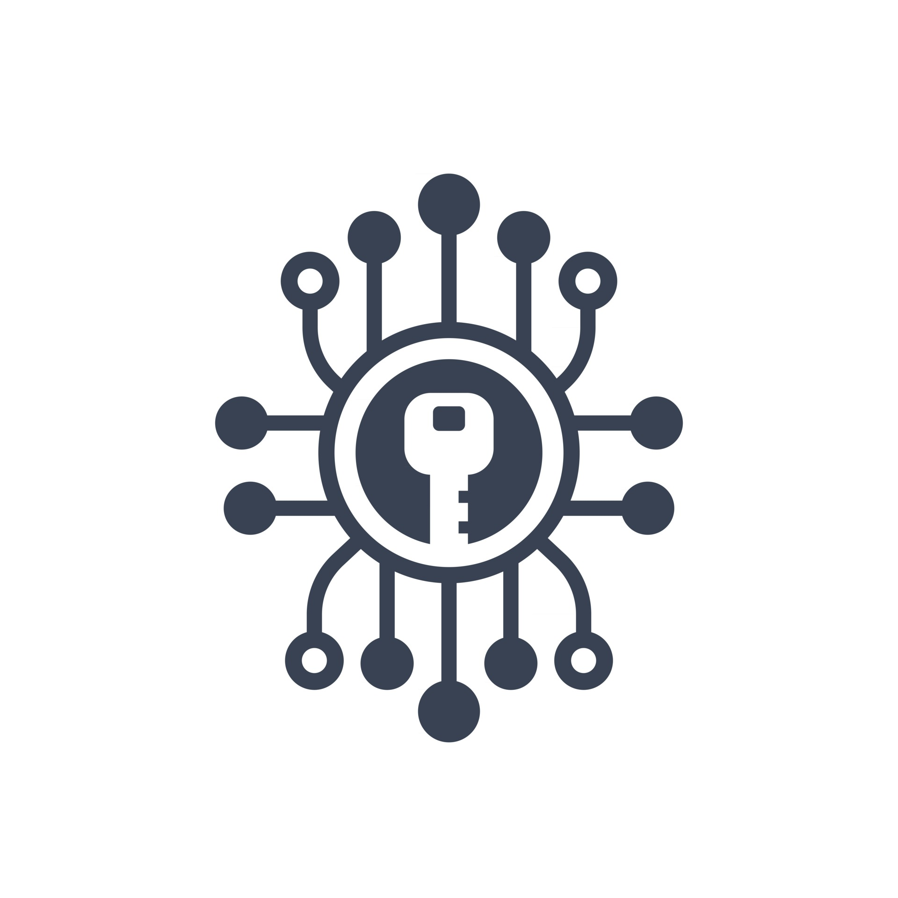

== Hi 👋, I'm GoliathHagar

🎮 I am working as *Software Engineer* +
👀 I’m interested in *Building* and *Breaking* (*Hacking and CTF*) Software and not only +
🤝 I’m looking for help with *Mobile* *_UI Design_* +
🌱 I’m currently learning *CodeQL* +

////
image::https://github-readme-stats.vercel.app/api/top-langs/?username=goliathhagar&hide=html&hide_title=true&hide_border=true&layout=compact&langs_count=10&theme=dark[]
image::https://github-profile-trophy.vercel.app/?username=goliathhagar[] QL
////

Something interesting... +
image:exploits_of_a_mom.png[]

=== Cybersecurity Projects

https://github.com/GoliathHagar/cryptography-training[ Cryptography]
https://github.com/GoliathHagar/distributed_legder_kademlia[

 kademlia & Blockchain]

=== Languages

https://www.python.org[image:https://raw.githubusercontent.com/devicons/devicon/master/icons/python/python-original.svg[python,40,40]]
https://www.java.com[image:https://raw.githubusercontent.com/devicons/devicon/master/icons/java/java-original.svg[java,40,40]]
https://www.rust-lang.org[image:https://raw.githubusercontent.com/devicons/devicon/master/icons/rust/rust-original.svg[rust,40,40]]
https://kotlinlang.org[image:https://www.vectorlogo.zone/logos/kotlinlang/kotlinlang-icon.svg[kotlin,40,40]]
https://www.gnu.org/software/bash/[image:https://www.vectorlogo.zone/logos/gnu_bash/gnu_bash-icon.svg[bash,40,40]]
https://www.cprogramming.com/[image:https://raw.githubusercontent.com/devicons/devicon/master/icons/c/c-original.svg[c,40,40]]
https://www.w3schools.com/cpp/[image:https://raw.githubusercontent.com/devicons/devicon/master/icons/cplusplus/cplusplus-original.svg[cplusplus,40,40]]
https://www.php.net[image:https://raw.githubusercontent.com/devicons/devicon/master/icons/php/php-original.svg[php,40,40]]
https://dart.dev[image:https://www.vectorlogo.zone/logos/dartlang/dartlang-icon.svg[dart,40,40]]
https://www.typescriptlang.org/[image:https://raw.githubusercontent.com/devicons/devicon/master/icons/typescript/typescript-original.svg[typescript,40,40]]
https://developer.mozilla.org/en-US/docs/Web/JavaScript[image:https://raw.githubusercontent.com/devicons/devicon/master/icons/javascript/javascript-original.svg[javascript,40,40]]
https://www.mathworks.com/[image:https://upload.wikimedia.org/wikipedia/commons/2/21/Matlab_Logo.png[matlab,40,40]]
https://en.wikipedia.org/wiki/Assembly_language[image:https://raw.githubusercontent.com/simple-icons/simple-icons/develop/icons/assemblyscript.svg[assembly,40,40]]

=== Databases

https://www.mysql.com/[image:https://raw.githubusercontent.com/devicons/devicon/master/icons/mysql/mysql-original-wordmark.svg[mysql,40,40]]
https://www.postgresql.org[image:https://raw.githubusercontent.com/devicons/devicon/master/icons/postgresql/postgresql-original-wordmark.svg[postgresql,40,40]]
https://www.oracle.com/[image:https://raw.githubusercontent.com/devicons/devicon/master/icons/oracle/oracle-original.svg[oracle,40,40]]
https://www.mongodb.com/[image:https://raw.githubusercontent.com/devicons/devicon/master/icons/mongodb/mongodb-original-wordmark.svg[mongodb,40,40]]
https://redis.io[image:https://raw.githubusercontent.com/devicons/devicon/master/icons/redis/redis-original-wordmark.svg[redis,40,40]]
https://mariadb.org/[image:https://www.vectorlogo.zone/logos/mariadb/mariadb-icon.svg[mariadb,40,40]]
https://www.sqlite.org/[image:https://www.vectorlogo.zone/logos/sqlite/sqlite-icon.svg[sqlite,40,40]]

=== DevOps nd Cloud

https://git-scm.com/[image:https://www.vectorlogo.zone/logos/git-scm/git-scm-icon.svg[git,40,40]]
https://www.jenkins.io[image:https://www.vectorlogo.zone/logos/jenkins/jenkins-icon.svg[jenkins,40,40]]
https://www.docker.com/[image:https://raw.githubusercontent.com/devicons/devicon/master/icons/docker/docker-original-wordmark.svg[docker,40,40]]
https://kubernetes.io[image:https://www.vectorlogo.zone/logos/kubernetes/kubernetes-icon.svg[kubernetes,40,40]]
https://azure.microsoft.com/en-in/[image:https://www.vectorlogo.zone/logos/microsoft_azure/microsoft_azure-icon.svg[azure,40,40]]
https://cloud.google.com[image:https://www.vectorlogo.zone/logos/google_cloud/google_cloud-icon.svg[gcp,40,40]]
https://www.vagrantup.com/[image:https://www.vectorlogo.zone/logos/vagrantup/vagrantup-icon.svg[vagrant,40,40]]

=== Web Development

https://spring.io/[image:https://www.vectorlogo.zone/logos/springio/springio-icon.svg[spring,40,40]]
https://angular.io[image:https://angular.io/assets/images/logos/angular/angular.svg[angular,40,40]]
https://www.djangoproject.com/[image:https://cdn.worldvectorlogo.com/logos/django.svg[django,40,40]]
https://nodejs.org[image:https://raw.githubusercontent.com/devicons/devicon/master/icons/nodejs/nodejs-original-wordmark.svg[nodejs,40,40]]
https://www.w3.org/html/[image:https://raw.githubusercontent.com/devicons/devicon/master/icons/html5/html5-original-wordmark.svg[html5,40,40]]
https://www.w3schools.com/css/[image:https://raw.githubusercontent.com/devicons/devicon/master/icons/css3/css3-original-wordmark.svg[css3,40,40]]
https://getbootstrap.com[image:https://raw.githubusercontent.com/devicons/devicon/master/icons/bootstrap/bootstrap-plain-wordmark.svg[bootstrap,40,40]]

=== Mobile Development

https://flutter.dev[image:https://www.vectorlogo.zone/logos/flutterio/flutterio-icon.svg[flutter,40,40]]
https://developer.android.com[image:https://raw.githubusercontent.com/devicons/devicon/master/icons/android/android-original-wordmark.svg[android,40,40]]
https://dotnet.microsoft.com/apps/xamarin[image:https://raw.githubusercontent.com/detain/svg-logos/780f25886640cef088af994181646db2f6b1a3f8/svg/xamarin.svg[xamarin,40,40]]

=== Design Tools

https://www.figma.com/[image:https://www.vectorlogo.zone/logos/figma/figma-icon.svg[figma,40,40]]

=== Other Tools and Technologies

https://kafka.apache.org/[image:https://www.vectorlogo.zone/logos/apache_kafka/apache_kafka-icon.svg[kafka,40,40]]
https://firebase.google.com/[image:https://www.vectorlogo.zone/logos/firebase/firebase-icon.svg[firebase,40,40]]
https://grafana.com[image:https://www.vectorlogo.zone/logos/grafana/grafana-icon.svg[grafana,40,40]]
https://www.elastic.co/kibana[image:https://www.vectorlogo.zone/logos/elasticco_kibana/elasticco_kibana-icon.svg[kibana,40,40]]
https://opencv.org/[image:https://www.vectorlogo.zone/logos/opencv/opencv-icon.svg[opencv,40,40]]
https://pandas.pydata.org/[image:https://raw.githubusercontent.com/devicons/devicon/2ae2a900d2f041da66e950e4d48052658d850630/icons/pandas/pandas-original.svg[pandas,40,40]]
https://www.tensorflow.org[image:https://www.vectorlogo.zone/logos/tensorflow/tensorflow-icon.svg[tensorflow,40,40]]
